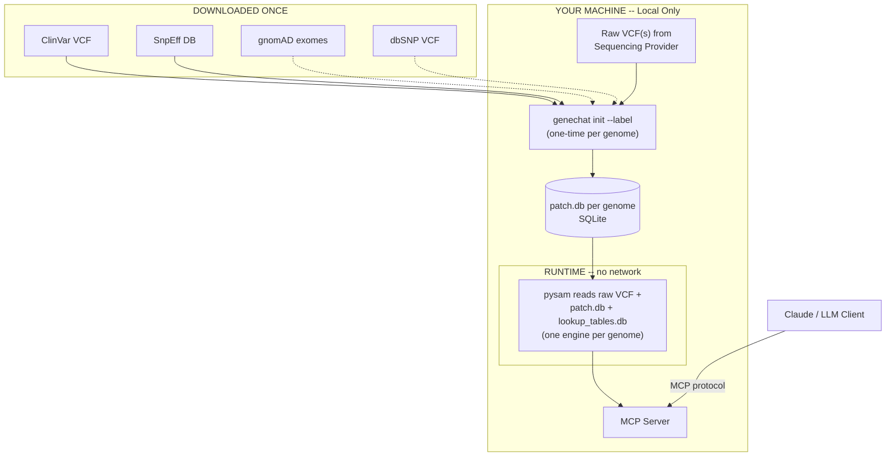

# GeneChat MCP Server

A local-first MCP server that lets you have detailed conversations with AI about your genome. Query your whole-genome sequencing data through Claude (or any MCP-compatible LLM) for pharmacogenomics, disease risk, nutrition, exercise genetics, carrier screening, and more — with your data never leaving your machine.

> **Privacy Notice:** GeneChat reads your VCF locally, but tool responses — containing your genotypes, rsIDs, and clinical interpretations — are sent to your LLM provider (e.g. Anthropic, OpenAI) as part of the conversation. Your raw VCF file is never uploaded, but the LLM does see the specific variants and findings returned by each tool call. See [Security Recommendations](#security-recommendations) below.

## What It Does

You get your genome sequenced ($250–$900 from providers like Nucleus Genomics or Nebula Genomics). You download the raw VCF file. GeneChat annotates it once with open-source tools, then serves it locally via MCP so you can ask questions like:

- "I was just prescribed simvastatin — any genetic concerns?"
- "What does my genome say about cardiovascular risk?"
- "I do heavy lifting and kiteboarding — any genetic injury risk factors?"
- "How should I think about my diet based on my genetics?"
- "I have surgery next month. What should I tell my anesthesiologist?"
- "Am I a carrier for anything concerning?"

The LLM calls GeneChat's tools behind the scenes, gets your specific genotypes and annotations, and interprets the results in context.

## How It Works

```
You ask a question in Claude
    → Claude picks the right GeneChat tool
    → GeneChat queries your local VCF with pysam
    → Returns your genotype + clinical annotations
    → Claude interprets the results for you
```

Your genome data stays on your machine. GeneChat only reads from local files. No network calls at runtime.

## Tools

| Tool | Purpose |
|------|---------|
| `query_variant` | Look up a single variant by rsID or position |
| `query_variants` | Batch lookup of multiple rsIDs in a single VCF scan |
| `query_gene` | List notable variants in a gene with smart filter |
| `query_genes` | Batch query variants across multiple genes at once |
| `query_pgx` | Pharmacogenomics lookup by drug or gene (CPIC data) |
| `query_clinvar` | Find clinically significant variants |
| `query_gwas` | Search the GWAS Catalog by trait, gene, or variant |
| `calculate_prs` | Polygenic risk scores (PGS Catalog data) |
| `genome_summary` | High-level overview of your genome |

## CLI Commands

| Command | Purpose |
|---------|---------|
| `genechat init <vcf> [--label] [--gnomad] [--dbsnp] [--gwas]` | Full first-time setup: annotate, write config |
| `genechat add <vcf> [--label]` | Register a VCF file without annotation |
| `genechat annotate [--clinvar] [--gnomad] [--snpeff] [--dbsnp] [--all] [--genome]` | Build or update patch.db (auto-downloads references) |
| `genechat install [--gwas] [--force]` | Install genome-independent reference databases |
| `genechat update [--apply] [--genome] [--seeds]` | Check for newer reference versions |
| `genechat status [--json]` | Show all registered genomes and annotation state |
| `genechat serve` / `genechat` | Start the MCP server |

**Global flags:** `--version` (print version), `--no-color` (disable colored output). Color output respects the `NO_COLOR` environment variable and is automatically disabled when stdout or stderr is not a TTY.

Running `genechat` with no subcommand in an interactive terminal shows a help summary. When stdin is piped (e.g. from an MCP client), it starts the server — so existing MCP configurations are unaffected.

### Exit Codes

| Code | Meaning |
|------|---------|
| 0 | Success |
| 1 | General/unexpected error |
| 2 | Invalid usage (bad arguments) |
| 3 | Configuration error (missing config, no VCF registered) |
| 4 | VCF error (file not found, invalid, missing index) |
| 5 | External tool error (bcftools/snpEff not found) |
| 6 | Network error (download failed) |
| 130 | Interrupted (Ctrl-C) |

> **Note:** `bcftools` and `tabix` are required for annotation (ClinVar contig rename, gnomAD, and dbSNP). References are auto-downloaded when needed. gnomAD (`--gnomad`) downloads ~150 GB of per-chromosome exome VCFs. dbSNP (`--dbsnp`) downloads ~20 GB from NCBI. Neither is included in the default `genechat init` — pass the flags explicitly to enable them.

## Prerequisites

- Python 3.11+
- A consumer WGS VCF file (from Nucleus Genomics, Nebula, Sequencing.com, etc.)
- Disk for reference databases (see table below), ~2 GB for your raw VCF + patch.db

**For annotation** (one-time setup):

```bash
# macOS (Homebrew)
brew install bcftools brewsci/bio/snpeff

# Linux (conda)
conda install -c bioconda bcftools snpeff
```

VCF reading at runtime is handled by [pysam](https://pysam.readthedocs.io/), installed automatically via `uv sync`. No external tools needed at runtime.

## Quickstart

### Option A: Install from source (recommended for development)

```bash
git clone https://github.com/natecostello/genechat-mcp.git
cd genechat-mcp
uv sync
```

### Option B: Install as a tool

```bash
uv tool install git+https://github.com/natecostello/genechat-mcp.git
# or: pip install git+https://github.com/natecostello/genechat-mcp.git
```

### Install annotation tools

```bash
# macOS
brew install bcftools brewsci/bio/snpeff

# Linux
conda install -c bioconda bcftools snpeff
```

### Initialize GeneChat

`genechat init` handles the entire setup in one command — validates your VCF, auto-fixes contig names if needed, downloads references, annotates, builds lookup tables, writes config, and prints the MCP JSON snippet:

```bash
# If installed from source:
uv run genechat init /path/to/your/raw.vcf.gz --label personal

# If installed as a tool:
genechat init /path/to/your/raw.vcf.gz --label personal
```

**For best results**, add `--gwas` to enable trait association queries (~58 MB download, ~300 MB on disk after building):

```bash
uv run genechat init /path/to/your/raw.vcf.gz --label personal --gwas
```

This will:
1. Detect and fix bare contig names (e.g. GIAB VCFs use `1`, `2` instead of `chr1`, `chr2`)
2. Download ClinVar and SnpEff databases
3. Build a patch database with functional annotations and clinical significance
4. Install the GWAS Catalog for trait/disease association lookups
5. Write a `config.toml` to your OS config directory (`~/Library/Application Support/genechat/` on macOS, `~/.config/genechat/` on Linux)
6. Print the MCP JSON to paste into Claude Desktop or Claude Code

**Optional extras** (combine any flags in a single init):

```bash
# Also include gnomAD population frequencies for smarter gene filtering
uv run genechat init /path/to/your/raw.vcf.gz --gnomad --gwas
```

gnomAD is optional; without it, `query_gene` falls back to ClinVar-only filtering. Both gnomAD and GWAS can be added after init via `genechat annotate --gnomad` / `genechat install --gwas`.

> **Disk usage:** `--gnomad` downloads each gnomAD chromosome, annotates from it, then deletes the file — peak disk usage is ~17 GB (one chromosome) rather than ~150 GB for all files at once.

> **Time estimate:** Default init takes ~10–15 minutes (SnpEff annotation + ClinVar). With `--gnomad`, allow additional time for the per-chromosome downloads (~150 GB total). Total annotation time depends on VCF size and machine specs.

### Don't have your genome sequenced?

You can explore GeneChat using the [GIAB NA12878](https://www.nist.gov/programs-projects/genome-bottle) benchmark genome — a well-characterized reference sample with ~3.7M variants:

```bash
# Download the benchmark VCF (~120 MB)
curl -L -O https://ftp-trace.ncbi.nlm.nih.gov/giab/ftp/release/NA12878_HG001/NISTv4.2.1/GRCh38/HG001_GRCh38_1_22_v4.2.1_benchmark.vcf.gz

# Initialize (auto-fixes contig names, downloads references, annotates)
uv run genechat init HG001_GRCh38_1_22_v4.2.1_benchmark.vcf.gz --label giab --gwas
```

Then ask Claude questions just like you would with your own genome.

### Start asking questions

Open Claude and ask about your genetics. GeneChat's tools will appear automatically.

### Multiple genomes

GeneChat supports named genomes for side-by-side comparison (e.g. carrier screening for couples):

```bash
# Register a second genome
uv run genechat init /path/to/partner.vcf.gz --label partner

# Check what's registered
uv run genechat status
```

The LLM can then query both genomes using the `genome` and `genome2` parameters on any tool.

## Architecture



Your raw VCF is never modified. Annotations are stored in a separate SQLite patch database (`patch.db`), making updates fast and non-destructive. Architecture decisions are documented as [ADRs](docs/architecture/).

### Annotation Pipeline (one-time, handled by `genechat init`)

| Tool | What it adds | Install |
|------|-------------|---------|
| [SnpEff](https://pcingola.github.io/SnpEff/) | Functional annotation — gene name, effect type, impact level, protein change | `brew install brewsci/bio/snpeff` |
| [bcftools](https://samtools.github.io/bcftools/) | Database annotation — transfers ClinVar/gnomAD/dbSNP fields into patch.db | `brew install bcftools` |

For incremental updates of individual annotation layers (e.g., updating ClinVar without re-running the full pipeline), see [docs/annotation-updates.md](docs/annotation-updates.md).

### Reference Databases

| Database | What it provides | Size | Flag |
|----------|-----------------|------|------|
| [ClinVar](https://www.ncbi.nlm.nih.gov/clinvar/) | Clinical significance, disease/condition name, review status | ~100 MB | Default |
| [SnpEff DB](https://pcingola.github.io/SnpEff/) | Gene/transcript models for functional impact prediction | ~1.6 GB | Default |
| [gnomAD](https://gnomad.broadinstitute.org/) | Population allele frequencies (global + per-population) | ~150 GB | `--gnomad` |
| [dbSNP](https://www.ncbi.nlm.nih.gov/snp/) | rsID identifiers for each genomic position | ~20 GB | `--dbsnp` |
| [GWAS Catalog](https://www.ebi.ac.uk/gwas/) | 1M+ genome-wide association study findings | ~58 MB download, ~300 MB on disk | `--gwas` |

Default `genechat init` downloads ClinVar + SnpEff (~2 GB). Optional annotation layers are enabled with flags (e.g. `genechat annotate --gnomad`). Genome-independent databases like GWAS are installed separately (`genechat install --gwas`).

### Seed Data Pipeline

Gene coordinates, PGx guidelines, and PRS weights are pre-built from external APIs and committed as TSVs in `data/seed/`. `genechat init` automatically builds the SQLite lookup database from these — no manual steps needed.

For developers updating seed data from upstream APIs:

| Source | What it provides | Script |
|--------|-----------------|--------|
| [HGNC](https://www.genenames.org/) + [Ensembl](https://rest.ensembl.org/) | All ~19,000 protein-coding gene coordinates | `fetch_gene_coords.py` |
| [CPIC](https://cpicpgx.org/) via [ClinPGx API](https://api.cpicpgx.org/v1/) | PGx drug-gene guidelines, star-allele definitions | `fetch_cpic_data.py` |
| [PGS Catalog](https://www.pgscatalog.org/) | Polygenic risk score weights (GRCh38) | `fetch_prs_data.py` |

Rebuild everything: `uv run genechat update --seeds`

### Runtime Dependencies

At runtime, GeneChat uses **only** local files — no external tools, no network calls.

| Library | What it does |
|---------|-------------|
| [pysam](https://pysam.readthedocs.io/) | Reads your raw VCF via tabix index |
| [mcp](https://github.com/anthropics/python-sdk) | Implements the MCP server protocol |
| SQLite (stdlib) | Queries lookup tables for gene coordinates, drug info, PRS weights |
| [pydantic](https://docs.pydantic.dev/) | Validates tool inputs and config |

## Security Recommendations

| Data | Where it lives | Transmitted? |
|------|---------------|-------------|
| Your VCF file | Your machine only | Never |
| Tool responses (genotypes, rsIDs, findings) | Sent to LLM provider per tool call | Yes |
| Conversation history | MCP client logs (local) | Depends on client settings |

GeneChat makes **zero network calls** at runtime. However, every tool response is returned to the LLM, which runs on the provider's servers.

Store your VCF on an encrypted volume and `chmod 600` your VCF and config files. `genechat init` sets restrictive permissions on the config automatically. MCP clients may log conversation history locally — be aware of cloud sync on those directories. See [docs/security.md](docs/security.md) for platform-specific encryption instructions (APFS, LUKS).

**Privacy summary:** No telemetry, no analytics, no data collection. Your VCF never leaves your machine. Tool responses are sent to your LLM provider as part of the conversation.

## Development / Testing

```bash
uv sync --extra dev
uv run pytest
uv run ruff check . && uv run ruff format --check .
```

The test VCF (`tests/data/test_sample.vcf.gz`) is auto-generated by a pytest fixture on first run.

### End-to-End Testing with GIAB NA12878

Optional e2e tests against the [GIAB NA12878](https://www.nist.gov/programs-projects/genome-bottle) benchmark genome (~3.7M variants):

```bash
# Download and init GIAB (see "Don't have your genome sequenced?" above)
# Include --dbsnp for rsID-based lookups in e2e tests
uv run genechat init HG001_GRCh38_1_22_v4.2.1_benchmark.vcf.gz --label giab --dbsnp

# Run e2e tests (point to the chrfixed VCF if contig rename was applied):
export GENECHAT_GIAB_VCF=./HG001_GRCh38_1_22_v4.2.1_benchmark_chrfixed.vcf.gz
uv run pytest tests/e2e/ -v

# Fast only (skip full-VCF scans):
uv run pytest tests/e2e/ -v -m "not slow"
```

E2e tests are automatically skipped when `GENECHAT_GIAB_VCF` is not set.

## Troubleshooting

**Missing VCF index (.tbi):** `tabix -p vcf /path/to/your/raw.vcf.gz`

**Wrong genome build:** GeneChat expects GRCh38 with `chr` prefixed chromosomes. GRCh37/hg19 VCFs need liftover first.

**Missing lookup_tables.db:** The lookup database ships with the package and is built automatically by `genechat init` in source checkouts. If somehow missing, rebuild with `uv run python scripts/build_lookup_db.py` (source) or reinstall the package.

**pysam installation issues on macOS:** `xcode-select --install`

## Important Disclaimer

GeneChat is an informational tool, not a medical device. It is not a substitute for professional genetic counseling or medical advice. Always discuss genetic findings with a qualified healthcare provider before making health decisions.

## License

MIT
