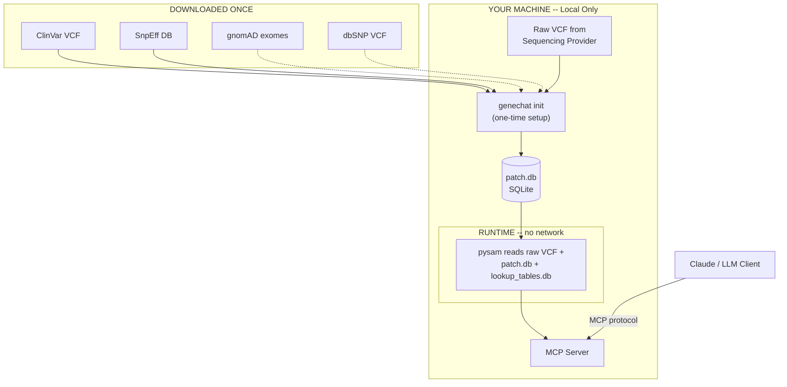

# GeneChat MCP Server

A local-first MCP server that lets you have detailed conversations with AI about your genome. Query your whole-genome sequencing data through Claude (or any MCP-compatible LLM) for pharmacogenomics, disease risk, nutrition, exercise genetics, carrier screening, and more — with your data never leaving your machine.

> **Privacy Notice:** GeneChat reads your VCF locally, but tool responses — containing your genotypes, rsIDs, and clinical interpretations — are sent to your LLM provider (e.g. Anthropic, OpenAI) as part of the conversation. Your raw VCF file is never uploaded, but the LLM does see the specific variants and findings returned by each tool call. See [Security Recommendations](#security-recommendations) below.

## What It Does

You get your genome sequenced ($250–$900 from providers like Nucleus Genomics or Nebula Genomics). You download the raw VCF file. GeneChat annotates it once with open-source tools, then serves it locally via MCP so you can ask questions like:

- "I was just prescribed simvastatin — any genetic concerns?"
- "What does my genome say about cardiovascular risk?"
- "I do heavy lifting and kiteboarding — any genetic injury risk factors?"
- "How should I think about my diet based on my genetics?"
- "I have surgery next month. What should I tell my anesthesiologist?"
- "Am I a carrier for anything concerning?"

The LLM calls GeneChat's tools behind the scenes, gets your specific genotypes and annotations, and interprets the results in context.

## How It Works

```
You ask a question in Claude
    → Claude picks the right GeneChat tool
    → GeneChat queries your local VCF with pysam
    → Returns your genotype + clinical annotations
    → Claude interprets the results for you
```

Your genome data stays on your machine. GeneChat only reads from local files. No network calls at runtime.

## Tools

| Tool | Purpose |
|------|---------|
| `query_variant` | Look up a single variant by rsID or position |
| `query_variants` | Batch lookup of multiple rsIDs in a single VCF scan |
| `query_gene` | List notable variants in a gene with smart filter |
| `query_genes` | Batch query variants across multiple genes at once |
| `query_pgx` | Pharmacogenomics lookup by drug or gene (CPIC data) |
| `query_clinvar` | Find clinically significant variants |
| `query_gwas` | Search the GWAS Catalog by trait, gene, or variant |
| `calculate_prs` | Polygenic risk scores (PGS Catalog data) |
| `genome_summary` | High-level overview of your genome |
| `rebuild_database` | Rebuild SQLite from existing seed TSVs |

## CLI Commands

| Command | Purpose |
|---------|---------|
| `genechat init <vcf> [--gnomad] [--dbsnp]` | Full first-time setup: download refs, annotate, write config |
| `genechat add <vcf>` | Register a VCF file without annotation |
| `genechat download [--gnomad] [--dbsnp] [--all] [--force]` | Download reference databases |
| `genechat annotate [--clinvar] [--gnomad] [--snpeff] [--dbsnp] [--all]` | Build or update patch.db annotation layers |
| `genechat update [--apply]` | Check for newer reference versions |
| `genechat status` | Show genome info and annotation state |
| `genechat serve` / `genechat` | Start the MCP server |

> **Note:** `bcftools` and `tabix` are required for annotation (ClinVar contig rename, gnomAD, and dbSNP). dbSNP rsID backfill (`--dbsnp`) downloads ~20 GB from NCBI and is not included in the default `genechat init` — pass `--dbsnp` explicitly to enable it.

## Prerequisites

- Python 3.11+
- A consumer WGS VCF file (from Nucleus Genomics, Nebula, Sequencing.com, etc.)
- ~15 GB disk for reference databases, ~2 GB for your annotated VCF

**For annotation** (one-time setup):

```bash
# macOS (Homebrew)
brew install bcftools brewsci/bio/snpeff

# Linux (conda)
conda install -c bioconda bcftools snpeff
```

VCF reading at runtime is handled by [pysam](https://pysam.readthedocs.io/), installed automatically via `uv sync`. No external tools needed at runtime.

## Quickstart

### 1. Clone and install

```bash
git clone https://github.com/natecostello/genechat-mcp.git
cd genechat-mcp
uv sync
```

### 2. Install annotation tools

```bash
# macOS
brew install bcftools brewsci/bio/snpeff

# Linux
conda install -c bioconda bcftools snpeff
```

### 3. Initialize GeneChat

`genechat init` handles the entire setup in one command — downloads references, annotates your VCF, builds lookup tables, writes config, and prints the MCP JSON snippet:

```bash
uv run genechat init /path/to/your/raw.vcf.gz
```

This will:
1. Download ClinVar and SnpEff databases
2. Build a patch database with functional annotations and clinical significance
3. Write a config file to `~/.config/genechat/config.toml`
4. Print the MCP JSON to paste into Claude Desktop or Claude Code

**Optional extras:**

```bash
# Include gnomAD population frequencies (~8 GB download)
uv run genechat init /path/to/your/raw.vcf.gz --gnomad

# Enable GWAS trait search (~58 MB download)
uv run python scripts/build_gwas_db.py
```

gnomAD is optional; without it, `query_gene` falls back to ClinVar-only filtering.

### 4. Start asking questions

Open Claude and ask about your genetics. GeneChat's tools will appear automatically.

## Architecture



Your raw VCF is never modified. Annotations are stored in a separate SQLite patch database (`patch.db`), making updates fast and non-destructive.

### Annotation Pipeline (one-time, handled by `genechat init`)

| Tool | What it adds | Install |
|------|-------------|---------|
| [SnpEff](https://pcingola.github.io/SnpEff/) | Functional annotation — gene name, effect type, impact level, protein change | `brew install brewsci/bio/snpeff` |
| [bcftools](https://samtools.github.io/bcftools/) | Database annotation — transfers ClinVar/gnomAD/dbSNP fields into patch.db | `brew install bcftools` |

For incremental updates of individual annotation layers (e.g., updating ClinVar without re-running the full pipeline), see [docs/annotation-updates.md](docs/annotation-updates.md).

### Reference Databases

| Database | What it provides | Size |
|----------|-----------------|------|
| [ClinVar](https://www.ncbi.nlm.nih.gov/clinvar/) | Clinical significance, disease/condition name, review status | ~100 MB |
| [dbSNP](https://www.ncbi.nlm.nih.gov/snp/) | rsID identifiers for each genomic position | ~20 GB |
| [gnomAD](https://gnomad.broadinstitute.org/) | Population allele frequencies (global + per-population) | ~8 GB (exomes) |
| [SnpEff DB](https://pcingola.github.io/SnpEff/) | Gene/transcript models for functional impact prediction | ~1.6 GB |
| [GWAS Catalog](https://www.ebi.ac.uk/gwas/) | 1M+ genome-wide association study findings | ~58 MB |

### Seed Data Pipeline

SQLite lookup tables are built from external APIs at build time (`uv run python scripts/build_seed_data.py`):

| Source | What it provides | Script |
|--------|-----------------|--------|
| [HGNC](https://www.genenames.org/) + [Ensembl](https://rest.ensembl.org/) | All ~19,000 protein-coding gene coordinates | `fetch_gene_coords.py` |
| [CPIC](https://cpicpgx.org/) via [ClinPGx API](https://api.cpicpgx.org/v1/) | PGx drug-gene guidelines, star-allele definitions | `fetch_cpic_data.py` |
| [PGS Catalog](https://www.pgscatalog.org/) | Polygenic risk score weights (GRCh38) | `fetch_prs_data.py` |

### Runtime Dependencies

At runtime, GeneChat uses **only** local files — no external tools, no network calls.

| Library | What it does |
|---------|-------------|
| [pysam](https://pysam.readthedocs.io/) | Reads your annotated VCF via tabix index |
| [mcp](https://github.com/anthropics/python-sdk) | Implements the MCP server protocol |
| SQLite (stdlib) | Queries lookup tables for gene coordinates, drug info, PRS weights |
| [pydantic](https://docs.pydantic.dev/) | Validates tool inputs and config |

## Security Recommendations

| Data | Where it lives | Transmitted? |
|------|---------------|-------------|
| Your VCF file | Your machine only | Never |
| Tool responses (genotypes, rsIDs, findings) | Sent to LLM provider per tool call | Yes |
| Conversation history | MCP client logs (local) | Depends on client settings |

GeneChat makes **zero network calls** at runtime. However, every tool response is returned to the LLM, which runs on the provider's servers.

Store your VCF on an encrypted volume and `chmod 600` your VCF and config files. `genechat init` sets restrictive permissions on the config automatically. MCP clients may log conversation history locally — be aware of cloud sync on those directories. See [docs/security.md](docs/security.md) for platform-specific encryption instructions (APFS, LUKS).

**Privacy summary:** No telemetry, no analytics, no data collection. Your VCF never leaves your machine. Tool responses are sent to your LLM provider as part of the conversation.

## Development / Testing

```bash
uv sync --extra dev
uv run pytest
uv run ruff check . && uv run ruff format --check .
```

The test VCF (`tests/data/test_sample.vcf.gz`) is auto-generated by a pytest fixture on first run.

### End-to-End Testing with GIAB NA12878

Optional e2e tests against the [GIAB NA12878](https://www.nist.gov/programs-projects/genome-bottle) benchmark genome (~3.7M variants):

```bash
# Download and annotate GIAB VCF (Python-only, no external tools needed):
uv run python scripts/setup_giab.py ./giab

# Build patch.db for GIAB (requires snpEff + bcftools):
uv run genechat init ./giab/HG001_annotated.vcf.gz

# Run e2e tests:
export GENECHAT_GIAB_VCF=./giab/HG001_annotated.vcf.gz
uv run pytest tests/e2e/ -v

# Fast only (skip full-VCF scans):
uv run pytest tests/e2e/ -v -m "not slow"
```

E2e tests are automatically skipped when `GENECHAT_GIAB_VCF` is not set.

## Troubleshooting

**Missing VCF index (.tbi):** `tabix -p vcf /path/to/your/annotated.vcf.gz`

**Wrong genome build:** GeneChat expects GRCh38 with `chr` prefixed chromosomes. GRCh37/hg19 VCFs need liftover first.

**Missing lookup_tables.db:** `genechat init` builds it automatically; or run `uv run python scripts/build_lookup_db.py` manually

**pysam installation issues on macOS:** `xcode-select --install`

## Important Disclaimer

GeneChat is an informational tool, not a medical device. It is not a substitute for professional genetic counseling or medical advice. Always discuss genetic findings with a qualified healthcare provider before making health decisions.

## License

MIT
